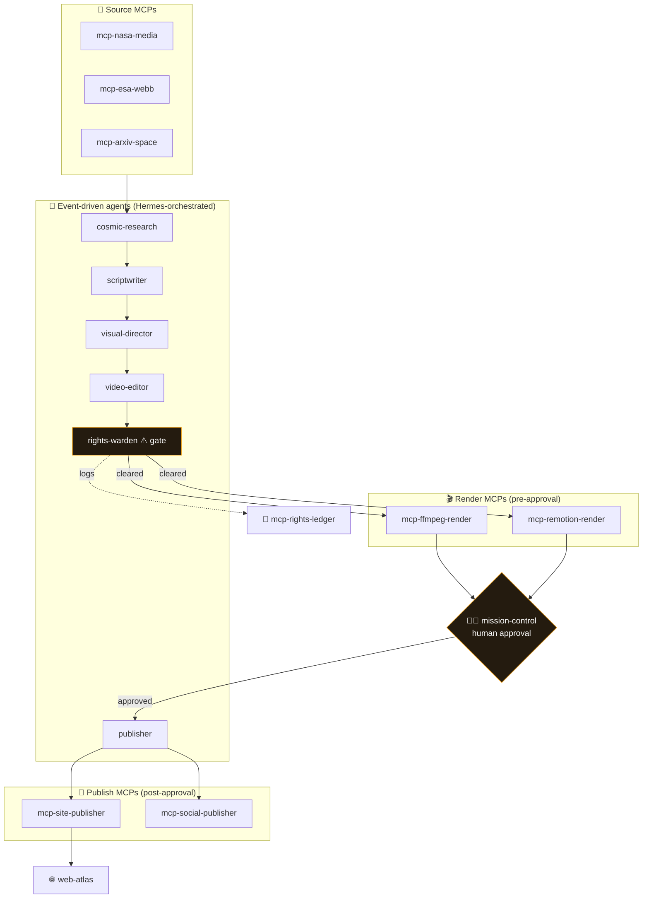

<div align="center">

# 🌌 Starlight Cosmos Engine

### A production monorepo that turns real space science into cinematic content

> NASA, ESA/Webb, and arXiv source material → researched scripts → rendered shorts,
> reels, and atlas pages — coordinated by event-driven agents, gated by mandatory
> rights checks, and auditable end to end.


[](https://github.com/frankxai/Starlight-Intelligence-System)

[**🗺️ Architecture**](#architecture) · [**🛰️ Pipelines**](#pipelines) · [**🤖 Agents**](#agents) · [**🔌 MCP servers**](#mcp-servers) · [**🚀 Getting started**](#getting-started)

</div>

---

> [!NOTE]
> A workspace monorepo with six layers — **apps, agents, MCP servers, skills, pipelines, and
> shared packages**. Rights and attribution checks are mandatory gates; every pipeline stage
> emits auditable events; human approval gates guard every high-risk publishing action.

---

<a id="architecture"></a>

## 🗺️ Architecture

Publishing happens only **after** the human approval gate — render is pre-approval, publish is post-approval.



### Runtime domains
| Layer | Role |
|---|---|
| **Apps** (`apps/`) | API backbone, `mission-control` approvals, and the `web-atlas` publishing surface. |
| **Agents** (`agents/`) | Event-driven workers coordinated by Hermes orchestration. |
| **MCP servers** (`mcp-servers/`) | External capability adapters with audit-focused boundaries. |
| **Skills** (`skills/`) | Reusable recipes that compose agents and MCP servers. |
| **Pipelines** (`pipelines/`) | Declarative DAGs that execute production workflows. |
| **Packages** (`packages/`) | Shared `auth`, `config`, `logging`, `queue-event-client`, `schemas`, `telemetry`. |

### Core principles
1. Rights and attribution checks are **mandatory gates**.
2. Every pipeline stage emits **auditable events**.
3. **Human approval gates** exist for high-risk publishing actions.

---

<a id="pipelines"></a>

## 🛰️ Pipelines

Declarative DAGs in [`pipelines/`](pipelines/):

| Pipeline | What it produces |
|---|---|
| `daily-cosmos-short` | A daily short-form video from the day's best space imagery. |
| `weekly-cosmic-briefing` | A weekly briefing assembled from research + media. |
| `research-digest` | A digest distilled from arXiv space-science papers. |
| `multi-platform-publish` | Fan-out publishing across platforms with rights checks. |
| `starlight-atlas-page` | A published atlas page on the web surface. |

---

<a id="agents"></a>

## 🤖 Agents

Nine event-driven workers in [`agents/`](agents/), coordinated by `hermes-orchestrator`:

`hermes-orchestrator` · `analytics-agent` · `archivist-agent` · `cosmic-research-agent` ·
`publisher-agent` · `rights-warden-agent` · `scriptwriter-agent` · `video-editor-agent` · `visual-director-agent`

---

<a id="mcp-servers"></a>

## 🔌 MCP servers

Capability adapters in [`mcp-servers/`](mcp-servers/), each with audit-focused boundaries:

**Sources** — `mcp-nasa-media` · `mcp-esa-webb` · `mcp-arxiv-space`
**Render** — `mcp-ffmpeg-render` · `mcp-remotion-render`
**Publish** — `mcp-site-publisher` · `mcp-social-publisher`
**Governance** — `mcp-rights-ledger` · `mcp-analytics`

---

<a id="getting-started"></a>

## 🚀 Getting started

```bash
npm install
npm run lint
npm run typecheck
npm run build:schemas   # build shared contract schemas
npm run test            # vitest
npm run build
```

---

## 📚 Docs

[`architecture.md`](docs/architecture.md) · [`content-quality-bar.md`](docs/content-quality-bar.md) ·
[`rights-and-credit-policy.md`](docs/rights-and-credit-policy.md) · [`contribution-guide.md`](docs/contribution-guide.md) ·
[`roadmap.md`](docs/roadmap.md)

---

<div align="center">

**Built on SIP** · Starlight Intelligence Protocol · _Rights-gated. Auditable. Human-approved._

</div>
