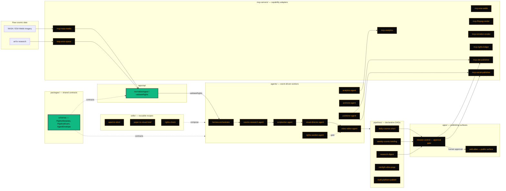

# Starlight Cosmos Engine

A monorepo scaffold for a cosmos-content production system — turning raw space imagery and research into published stories through an agent + pipeline pipeline.

<p align="center">
  
</p>

<p align="center">
  <a href="https://github.com/frankxai/starlight-cosmos-engine/actions/workflows/ci.yml"></a>
  
  =22">
  
  <a href="LICENSE"></a>
  <a href="https://github.com/frankxai/starlight-intelligence-system"></a>
</p>

> **Honest status:** this is a real, well-formed npm-workspaces monorepo with 34 packages wired end-to-end by TypeScript project references and a working CI pipeline — but only two of those packages carry implemented logic today. Everything else is intentional scaffolding: a `moduleId` + `purpose` stub, a `package.json`, and a `tsconfig.json`, ready for a contributor to fill in. See [What's actually implemented](#whats-actually-implemented) below before you assume otherwise.

## What it is

Per `docs/architecture.md`, the engine is a six-layer workspace: **apps** (API backbone, mission-control approvals, web-atlas publishing surface), **agents** (event-driven workers coordinated by Hermes orchestration), **MCP servers** (external capability adapters with audit-focused boundaries), **skills** (reusable recipes that compose agents and MCP servers), **pipelines** (declarative DAGs that execute production workflows), and shared **packages** (contracts and infra utilities). Three principles anchor every layer: rights/attribution checks are mandatory gates, every pipeline stage emits an auditable event, and human approval gates sit in front of high-risk publishing actions. The `docs/roadmap.md` sequencing is Phase 1 — API + Mission Control + Hermes orchestration + the rights path + the Daily Cosmos Short pipeline end-to-end; Phase 2 — Web Atlas publishing plus multi-platform distribution and analytics; Phase 3 — full agent/skill expansion plus weekly and research pipelines.

## What's actually implemented

Verified by reading source, not folder names.

| Layer | Verified state |
|---|---|
| `packages/schemas` | **Implemented.** Real shared contracts — `RightsMetadata`, `PipelineEvent`, `AgentEnvelope`, `ContentStatus` — consumed by other workspaces. |
| `apps/api` | **Implemented.** `normalizeIngest`, `validateRights`, `orchestratePipelineEvent`, `toAgentEnvelope` are working functions against the `schemas` contracts, with a passing vitest suite. |
| `apps/web-atlas`, `apps/mission-control` | Scaffold only — a `moduleId`/`purpose` export, no logic. |
| `agents/*` (9 workers) | Scaffold only — same stub pattern in every `src/index.ts`. |
| `mcp-servers/*` (9 adapters) | Scaffold only — no MCP protocol wiring yet, just the stub export. |
| `pipelines/*` (5 DAGs) | Scaffold only. `research-digest` has a test file, but it only asserts the stub's metadata string. |
| `skills/*` (8 recipes) | Scaffold only. |
| `packages/auth`, `config`, `logging`, `queue-event-client`, `telemetry` | Scaffold only. |
| `docs/*` (5 files) | **Real, substantive.** Architecture, roadmap, rights-and-credit policy, content quality bar, and contribution guide are all written out — this README's claims are grounded in them. |
| Root tooling (`package.json` workspaces, `eslint.config.js`, `tsconfig.base.json`, `.github/workflows/ci.yml`) | **Real and working.** npm workspaces across all six layers, shared TS config, and a CI job that runs install → lint → typecheck → test → build on every push/PR. |

The takeaway: the *shape* of the system is fully designed and enforced by tooling (every workspace typechecks, lints, and builds in CI), but the *behavior* — agent logic, MCP adapters, pipeline execution, skill recipes — is Phase 1 work still ahead, per the roadmap.

## Quickstart

Scripts below are copied verbatim from `package.json` — all five exist and run against the full workspace tree.

```bash
npm install
npm run lint        # eslint . --ext .ts,.tsx
npm run typecheck   # builds packages/schemas first, then tsc --noEmit across all workspaces
npm run test        # vitest across all workspaces (passWithNoTests where no tests exist yet)
npm run build       # builds packages/schemas first, then every workspace with a build script
```

CI (`.github/workflows/ci.yml`) runs this exact sequence on every push to `main` and every pull request.

## Architecture

Flow per `docs/architecture.md`: raw source material enters through the API, gets normalized and rights-checked, flows through agent-executed pipeline stages coordinated by Hermes, and exits through publishing surfaces gated by human approval. Solid borders below are implemented; dashed borders are scaffolded (stub only, no logic yet).



## Structure

| Path | What's there |
|---|---|
| `apps/` | 3 workspaces — `api` (implemented ingestion/rights logic), `mission-control` (approval-gate stub), `web-atlas` (publishing-surface stub) |
| `agents/` | 9 event-driven worker stubs — `hermes-orchestrator`, `cosmic-research-agent`, `scriptwriter-agent`, `visual-director-agent`, `video-editor-agent`, `rights-warden-agent`, `archivist-agent`, `analytics-agent`, `publisher-agent` |
| `mcp-servers/` | 9 external capability adapter stubs — NASA media, ESA Webb, arXiv, ffmpeg render, Remotion render, rights ledger, site publisher, social publisher, analytics |
| `packages/` | 6 shared workspaces — `schemas` (implemented contracts), plus stubs for `auth`, `config`, `logging`, `queue-event-client`, `telemetry` |
| `pipelines/` | 5 declarative DAG stubs — `daily-cosmos-short`, `weekly-cosmic-briefing`, `research-digest`, `starlight-atlas-page`, `multi-platform-publish` |
| `skills/` | 8 reusable-recipe stubs — `apod-to-short`, `cosmic-myth-layer`, `image-to-cosmic-explainer`, `launch-to-reel`, `paper-to-visual-brief`, `rights-check`, `social-repurposer`, `thumbnail-brief` |
| `docs/` | Real governance docs — [`architecture.md`](docs/architecture.md), [`roadmap.md`](docs/roadmap.md), [`rights-and-credit-policy.md`](docs/rights-and-credit-policy.md), [`content-quality-bar.md`](docs/content-quality-bar.md), [`contribution-guide.md`](docs/contribution-guide.md) |
| `.github/workflows/ci.yml` | Working CI — install → lint → typecheck → test → build on every push/PR |

## Governance

- **Rights are a mandatory gate**, not an afterthought — every asset needs `source_id`, `source_url`, `license_type`, `creator_name`, and `attribution_text` before it's publish-eligible ([`docs/rights-and-credit-policy.md`](docs/rights-and-credit-policy.md)), enforced today in `apps/api`'s `validateRights`.
- **Content ships only when it clears defined quality thresholds** across factual accuracy, narrative clarity, visual coherence, platform fit, and rights completeness ([`docs/content-quality-bar.md`](docs/content-quality-bar.md)).
- **Contribution standards**: TypeScript strict mode across all workspaces, tests required for new contracts and skill logic, one scoped capability per pull request ([`docs/contribution-guide.md`](docs/contribution-guide.md)).

## Roadmap

1. **Phase 1 (MVP)** — API + Mission Control + Hermes orchestration + the rights path; Daily Cosmos Short pipeline end-to-end.
2. **Phase 2** — Web Atlas publishing; multi-platform publishing and the analytics loop.
3. **Phase 3** — Full agent and skill expansion; weekly and research pipelines with optimization controls.

Full detail: [`docs/roadmap.md`](docs/roadmap.md).

---

<p align="center">
  Part of the <a href="https://github.com/frankxai/starlight-intelligence-system">Starlight Intelligence System</a> ecosystem — built on the Starlight Intelligence Protocol (SIP) substrate.
</p>
